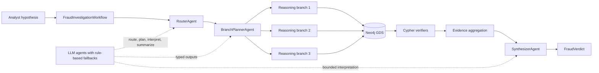
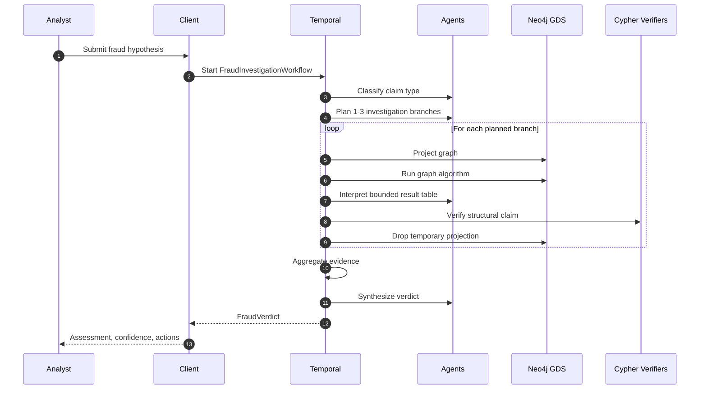
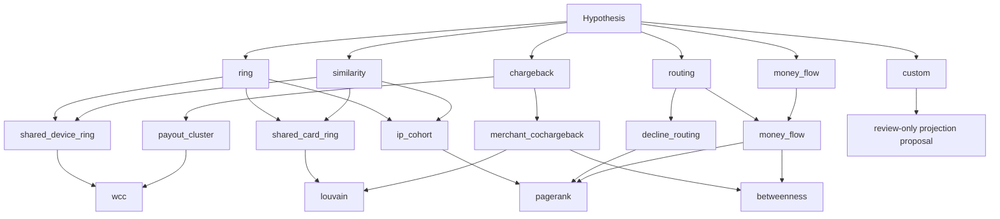
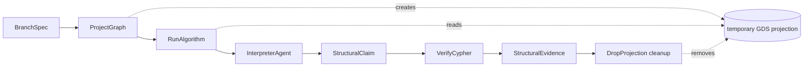

# Fraud Detection Agents

<p align="center">
  
  
  
  
</p>

Fraud Detection Agents is a Temporal-based research system for investigating
fraud hypotheses with graph algorithms, deterministic verification, and
LLM-assisted reasoning.

It turns an analyst's natural-language hypothesis into parallel Neo4j Graph Data
Science investigations, checks the resulting structural claims with fixed Cypher
probes, and returns a typed fraud verdict.

## System At A Glance



## Why This Architecture

| Layer | Responsibility | Guardrail |
| --- | --- | --- |
| Temporal workflows | Durable orchestration and parallel branch execution | Activity timeouts, retries, child workflows |
| Neo4j GDS | Fraud signal extraction from graph topology | Pre-registered projections and algorithms |
| LLM agents | Routing, planning, interpretation, and summary text | Typed Pydantic outputs and rule-based fallbacks |
| Cypher verifiers | Deterministic validation of structural claims | Fixed parameterized templates |

The important design choice is that graph algorithms produce the evidence. The
model selects from bounded catalogs and summarizes structured results; it does
not freely write production Cypher during normal investigations.

## Investigation Flow



## Fraud Signal Map



## Branch Lifecycle

Each reasoning branch is a small, recoverable investigation unit.



## Repository Layout

```text
src/
  activities/       Temporal activities for parse, plan, project, run, verify, synthesize
  agents/           PydanticAI agents and rule-based fallbacks
  contracts/        Pydantic data contracts
  gds/              Neo4j driver, projection library, algorithm library
  verifiers/        Deterministic Cypher verification templates
  workflows/        Temporal workflows for investigations and branches
  client.py         CLI/API entrypoint for submitting hypotheses
  worker.py         Temporal worker entrypoint
  metrics.py        Activity and token instrumentation

tests/
  fixtures/         Synthetic fraud graph seed data
  test_*.py         Projection, algorithm, verifier, agent, workflow, and eval tests

evals/
  scenarios.yaml    Demo scenarios and expected outcomes
  run_eval.py       Evaluation harness
  ablations.py      Ablation study runner
```

For a compact command runbook, see [RUN.md](RUN.md).

## Prerequisites

- Python 3.12 or newer. The local runbook examples use `py -3.13` on Windows.
- Temporal CLI for `temporal server start-dev`.
- Neo4j 5 with the Graph Data Science plugin enabled.
- An Anthropic API key for LLM mode.

The agents have deterministic fallback paths, but normal LLM mode expects
`ANTHROPIC_API_KEY` to be set.

## Setup

Create a virtual environment and install the project dependencies:

```powershell
py -3.13 -m venv .venv
.\.venv\Scripts\Activate.ps1
py -3.13 -m pip install -e .
py -3.13 -m pip install -e ".[dev]"
```

On macOS or Linux, use the same commands with `python` and
`source .venv/bin/activate`.

Create or update `.env`:

```dotenv
# Neo4j
NEO4J_URI=bolt://localhost:7687
NEO4J_USER=neo4j
NEO4J_PASSWORD=changeme

# Temporal
TEMPORAL_HOST=localhost:7233
TEMPORAL_NAMESPACE=default
TEMPORAL_TASK_QUEUE=fraud-agent

# LLM agents
ANTHROPIC_API_KEY=your-api-key
ANTHROPIC_MODEL=claude-sonnet-4-6

# Optional controls
MAX_BRANCHES=3
ROUTER_MODE=llm
PLANNER_MODE=llm
INTERPRETER_MODE=llm
VERIFIER_MODE=llm
SYNTHESIZER_MODE=llm
COMPOSER_MODE=llm
ALLOW_COMPOSER_AUTOEXEC=false
```

Set any agent mode to `rule-based` to force deterministic fallback behavior for
that component.

## Run Locally

Start Temporal:

```powershell
temporal server start-dev
```

Start Neo4j with GDS enabled. You can use Neo4j Desktop or a Docker-based Neo4j
instance, as long as the credentials match `.env`.

Start the worker from the repository root:

```powershell
py -3.13 src/worker.py
```

Submit a hypothesis in another terminal:

```powershell
py -3.13 src/client.py --hypothesis "Urgent review of a collusion ring where customers C1_1 and C1_2 appear to share the same device."
```

Return JSON instead of the pretty-printed verdict:

```powershell
py -3.13 src/client.py --hypothesis "Investigate payment decline routing anomalies across acquirers." --json
```

Temporal's local web UI is available at <http://localhost:8233> while the dev
server is running.

## Seed Data And Evaluations

The evaluation harness clears Neo4j, loads
[tests/fixtures/graph_seed.cypher](tests/fixtures/graph_seed.cypher), runs the
demo scenarios, and writes a report.

```powershell
make eval
```

Equivalent direct command:

```powershell
py -3.13 evals/run_eval.py --output evals/reports/latest.json
```

Run one or more ablation studies:

```powershell
py -3.13 evals/ablations.py baseline no_gds_verifier
py -3.13 evals/ablations.py --all
py -3.13 evals/ablations.py baseline --temp 0.0 0.3 0.5 0.7
```

Available predefined ablations include `baseline`, `no_gds_verifier`,
`no_cypher_verifier`, `single_branch`, `router_rule_based`,
`planner_rule_based`, `minimal_algo_set`, and `composer_always`.

## Test

Most tests require Neo4j with GDS because they build projections and execute GDS
procedures.

```powershell
py -3.13 -m pytest tests/ -v
```

Useful milestone slices:

```powershell
py -3.13 -m pytest tests/test_projections.py tests/test_algorithms.py -v
py -3.13 -m pytest tests/test_verifiers.py -v
py -3.13 -m pytest tests/test_workflow_branch.py -v
py -3.13 -m pytest tests/test_branch_agents.py -v
py -3.13 -m pytest tests/test_agents.py -v
py -3.13 -m pytest tests/test_workflow_investigation.py -v
py -3.13 -m pytest tests/test_composer.py tests/test_workflow_custom.py -v
py -3.13 -m pytest tests/test_eval_harness.py -v
```

## Claim Types

| Claim type | Purpose |
| --- | --- |
| `ring` | Collusion rings, shared devices, shared cards, and IP cohorts |
| `chargeback` | Merchant dispute or loss clusters |
| `routing` | Decline-routing and acquirer anomalies |
| `similarity` | Entity lookalike or behavioral similarity checks |
| `money_flow` | Settlement paths and funds-flow bottlenecks |
| `custom` | Review-only custom projection proposals |

## Projection Catalog

| Projection ID | Signal |
| --- | --- |
| `shared_device_ring` | Customers sharing devices |
| `shared_card_ring` | Customers sharing cards |
| `ip_cohort` | Customers from the same IP |
| `merchant_cochargeback` | Merchants sharing charged-back customers |
| `money_flow` | Settlement paths across payment entities |
| `payout_cluster` | Merchant, payout account, and country clusters |
| `decline_routing` | Acquirer decline patterns |

## Algorithm Catalog

| Algorithm | Use |
| --- | --- |
| `wcc` | Hard connected components and rings |
| `louvain` | Community detection |
| `pagerank` | Entity importance and routing influence |
| `node_similarity` | Lookalike detection |
| `betweenness` | Bottleneck and bridge entities |
| `fastrp_knn` | FastRP embedding plus nearest-neighbor search |

The allowed projection-to-algorithm mapping lives in
[src/gds/algorithms.py](src/gds/algorithms.py).

## Verification Templates

Verification is handled by fixed Cypher probes in
[src/verifiers/templates.py](src/verifiers/templates.py). Templates return
structured outcomes such as `AGREE`, `DISAGREE`, or `NOT_APPLICABLE`.

Current templates include:

- `confirm_component`
- `confirm_merchant_cochargeback`
- `confirm_payout_cluster`
- `confirm_money_flow_path`
- `confirm_decline_routing`

## Development Notes

Add a new projection:

1. Implement the projection in [src/gds/projections.py](src/gds/projections.py).
2. Register it in the projection library.
3. Add or update compatible algorithms in [src/gds/algorithms.py](src/gds/algorithms.py).
4. Add tests in [tests/test_projections.py](tests/test_projections.py).

Add a new algorithm:

1. Implement the runner in [src/gds/algorithms.py](src/gds/algorithms.py).
2. Add it to the projection-to-algorithm catalog.
3. Add tests in [tests/test_algorithms.py](tests/test_algorithms.py).

Add a new verifier:

1. Add a parameterized Cypher template in
   [src/verifiers/templates.py](src/verifiers/templates.py).
2. Map compatible structural claims to the template.
3. Add tests in [tests/test_verifiers.py](tests/test_verifiers.py).

Custom projection composition is review-first. Keep
`ALLOW_COMPOSER_AUTOEXEC=false` unless you explicitly want composer proposals to
be executed during a controlled experiment.

## Troubleshooting

`ModuleNotFoundError: No module named 'activities'`

Run the worker as a script from the repository root:

```powershell
py -3.13 src/worker.py
```

`ANTHROPIC_API_KEY` is missing

Set `ANTHROPIC_API_KEY` in `.env`, or force relevant agents to `rule-based`
mode while developing deterministic paths.

Client returns low-confidence or empty results

The Neo4j graph may be empty. Run the evaluation harness once to reseed:

```powershell
make eval
```

Temporal client times out

Make sure `temporal server start-dev` and `py -3.13 src/worker.py` are both
running, and that `TEMPORAL_TASK_QUEUE` matches in both processes.

Neo4j authentication fails

Check that `NEO4J_USER` and `NEO4J_PASSWORD` in `.env` match the running Neo4j
database.

## References

- [Temporal documentation](https://docs.temporal.io/)
- [Neo4j Graph Data Science documentation](https://neo4j.com/docs/graph-data-science/current/)
- [PydanticAI documentation](https://ai.pydantic.dev/)
- [Runbook](RUN.md)

## License

Research artifact for ICTAI submission.
